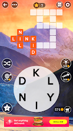
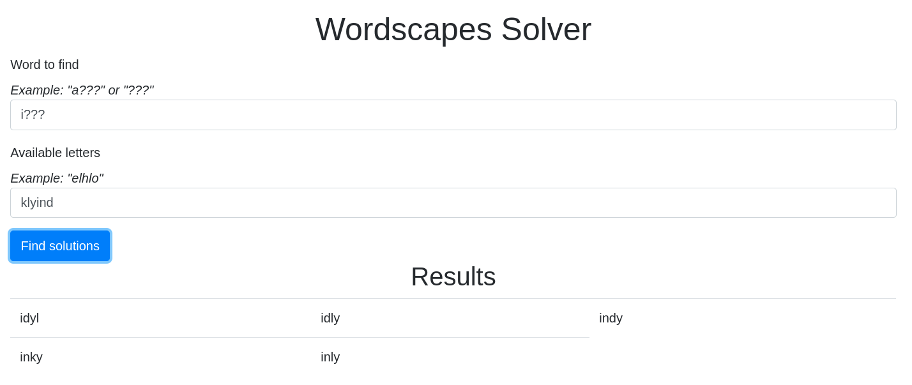

# wordscapes-solver
An application used to solve puzzles from the mobile game "Wordscapes"

# How to use
Go to https://antoine-gannat.github.io/wordscapes-solver/

In the first field, enter the word you are looking for. Replace the unknown letters by '?'.

In the second field, enter the letters available at the bottom of the screen.

# Example

## We try to solve this puzzle

We are looking for the word starting by an 'i' with a length of 4 characters.

We enter the following in the website:

Then juste press "Find solutions" to display the possible words !
